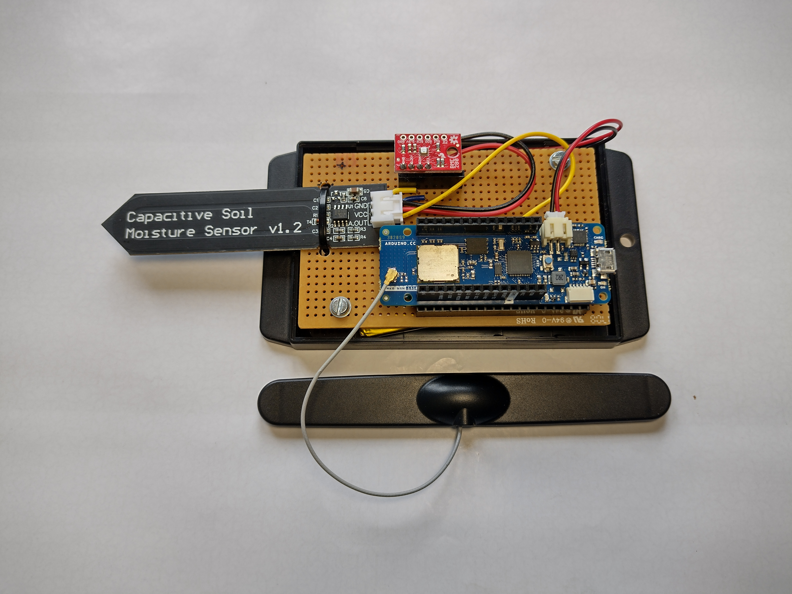
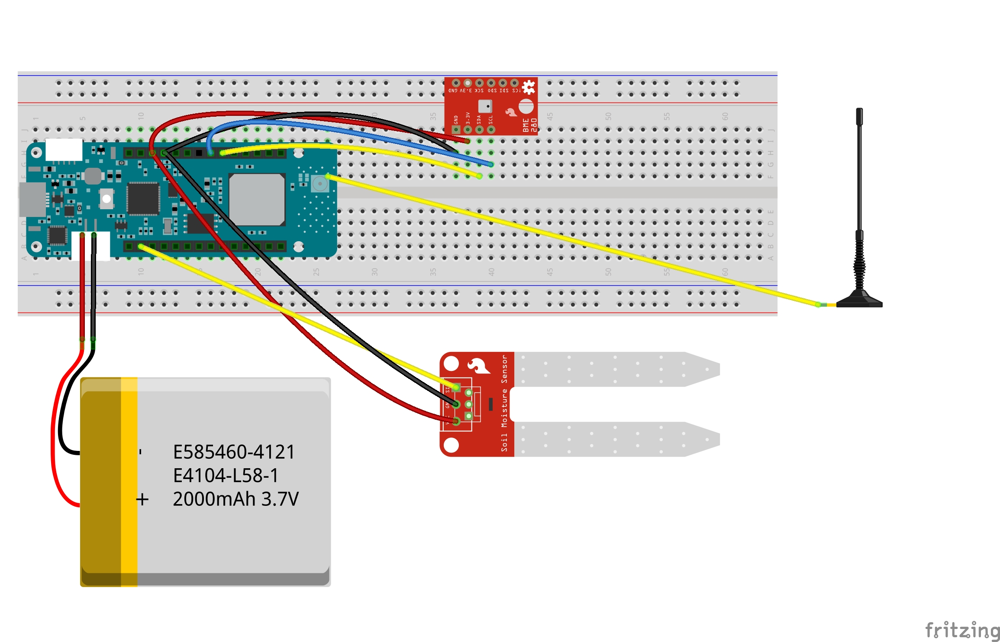

# helium-mkr1310-node
Arduino MKR1310 powered Helium LoRaWAN sensor node for soil moisture and environmental monitoring
A detailed write up of the project is avaiable on the OKdo Knowledge Hub:

Arduino MKR1310 sensor node pcb

Fritzing circuit diagram

